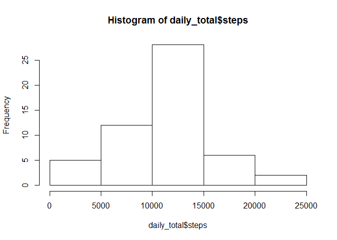
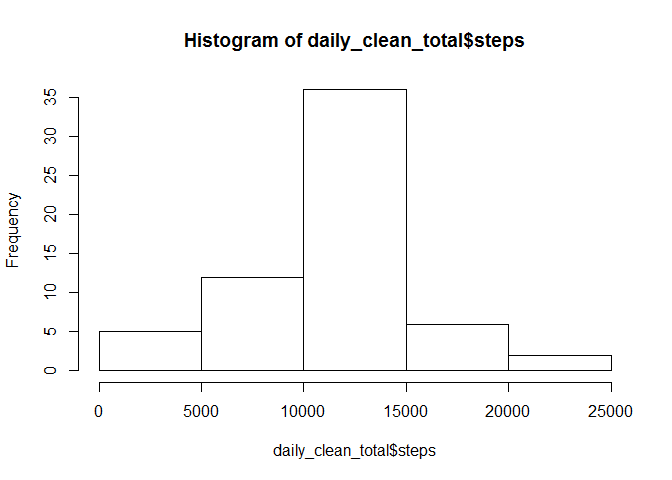

# Reproducible Research: Peer Assessment 1


## Loading and preprocessing the data

```r
# Check whether the raw data has been unzipped and unzip if necessary
data_local <- "activity.zip"
data_unzipped <- "activity"
if(!dir.exists(data_unzipped)){
  dir.create(data_unzipped)
  unzip(data_local, exdir = data_unzipped)
}
# Read the data
data <- read.csv("activity/activity.csv")
```


## What is mean total number of steps taken per day?

```r
# Total up the steps taken for each date
daily_total <- aggregate(steps~date, data = data, sum, na.rm = TRUE)
# Generate a histogram for the total number of steps taken per day
hist(daily_total$steps)
```

<!-- -->

```r
# Return the mean and median total number of steps per day
print(paste('The mean total number of steps taken per day is', round(mean(daily_total$steps),0)))
```

```
## [1] "The mean total number of steps taken per day is 10766"
```

```r
print(paste('The median total number of steps taken per day is', round(median(daily_total$steps),0)))
```

```
## [1] "The median total number of steps taken per day is 10765"
```


## What is the average daily activity pattern?

```r
# Take the mean number of steps for each five minute interval, across all days
interval_mean <- aggregate(steps~interval, data = data, mean, na.rm = TRUE)
# Plot the number of steps in a time-series type graph over each interval
plot(steps~interval, data = interval_mean, type = "l")
```

<!-- -->

```r
# Return the interval which contains the highest number of steps, on average
print(paste('The highest number of steps, on average, occurs in interval',interval_mean$interval[which.max(interval_mean$steps)]))
```

```
## [1] "The highest number of steps, on average, occurs in interval 835"
```

## Imputing missing values

```r
# Count up the total number of missing values in the data
print(paste('The number of missing rows in the data is', sum(is.na(data$steps))))
```

```
## [1] "The number of missing rows in the data is 2304"
```

```r
# Initialise a clean dataset
clean_data <- data
# Loop over the whjole dataset. If the value is missing, use the average number of steps which corresponds to that interval
for (i in 1:nrow(clean_data)){
    if (is.na(clean_data[i,]$steps)){
        clean_data[i,]$steps <- interval_mean[interval_mean$interval==clean_data[i,]$interval,]$steps
    }
}
# Total up the steps taken for each date in the clean dataset
daily_clean_total <- aggregate(steps~date, data = clean_data, sum, na.rm = TRUE)
# Generate a histogram for the total number of steps taken per day
hist(daily_clean_total$steps)
```

<!-- -->

```r
# Return the mean and median total number of steps per day
print(paste('The mean total number of steps taken per day is', round(mean(daily_clean_total$steps),0)))
```

```
## [1] "The mean total number of steps taken per day is 10766"
```

```r
print(paste('The median total number of steps taken per day is', round(median(daily_clean_total$steps),0)))
```

```
## [1] "The median total number of steps taken per day is 10766"
```

```r
# Check there are no missing values in the clean dataset
print(paste('The number of missing rows in the cleaned data is', sum(is.na(clean_data$steps))))
```

```
## [1] "The number of missing rows in the cleaned data is 0"
```


## Are there differences in activity patterns between weekdays and weekends?

```r
# Add a new column to the clean dataset data table which contains the day of the week
clean_data$day <- as.factor(weekdays(as.Date(clean_data$date)))
# Add a new column to the clean dataset data table which contains "weekday""
clean_data$daytype <- "weekday"
# If the day is a weekend day, change the day type to "weekend"
clean_data[clean_data$day=='Saturday'|clean_data$day=='Sunday',]$daytype <- "weekend"
# Change the column to be a factor rather than a character 
clean_data$daytype <- as.factor(clean_data$daytype)
# Take the mean number of steps for each five minute interval, across all days
interval_mean_2 = aggregate(steps ~ interval + daytype, clean_data, mean)
library(lattice)
# Plot the number of steps in a time-series type graph over each interval, for weekdays and weekends to allow comparison
xyplot(steps ~ interval | factor(daytype), data = interval_mean_2, aspect = 1/2, 
    type = "l")
```

<!-- -->


